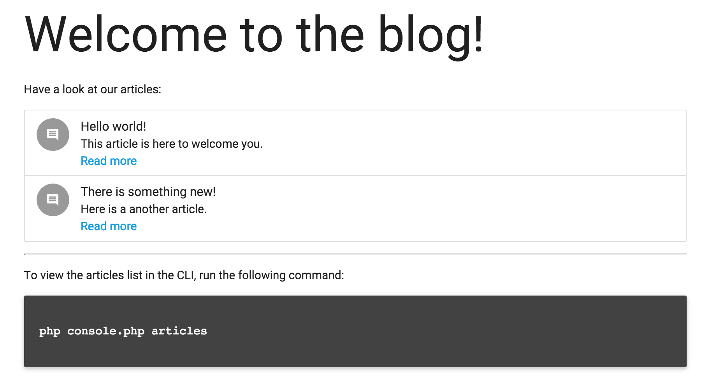

# PHP-DI application demo

This repository demonstrates how to write a simple application using PHP-DI without any framework.

## Screenshot

## Disclaimer

Watch out, this project is meant to show how to build an application from scratch with PHP-DI in the simplest way possible. Be aware that this code is only meant for learning purposes and should probably not go to production as-is.

Improvements and pull requests are welcome.

## Run

`make infra-up && make app-install`

[localhost](http://localhost:8000) 
Enjoy!
